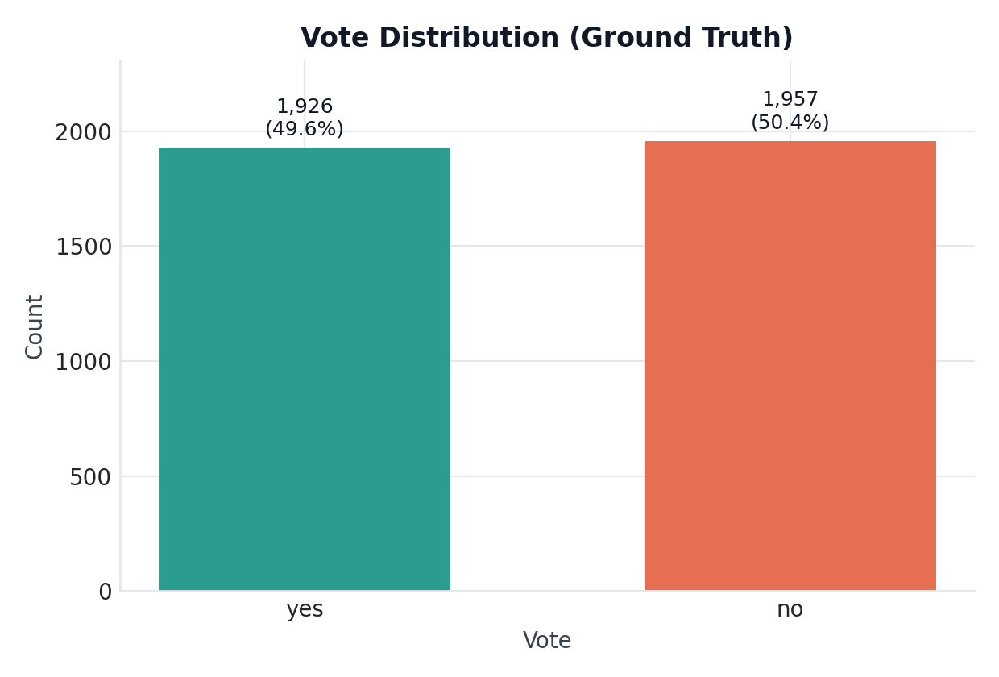

# LLM Survey Predictions

Simulate Swiss voting behavior with small LLMs and compare predictions against
real survey responses.

## What this repo does
- Prepares cleaned survey data with respondent profiles and issue-specific vote
  summaries.
- Prompts local LLMs to predict binary votes (yes/no) for each respondent.
- Stores model outputs alongside ground truth for analysis and visualization.

## Repository layout
- `src/`: model download, prompting, and evaluation notebooks/scripts.
- `data/`: processed datasets, results, and summaries (raw survey data excluded).
- `models/`: local GGUF model files (ignored by git).
- `docker/`: container setup for reproducible runs.
- `start.sh`: convenience script to run the Docker image.

## Prompt blueprint
Each example combines (1) the vote summary, (2) party recommendations, and
(3) a respondent profile. The model must answer with exactly `yes` or `no`.

```text
System: You are simulating the Swiss voter described by the user.
        Output exactly one of: yes, no.

User:
<vote summary text>
The major parties issued the following voting recommendations:
<party position text>

You are an <age> old <gender> with <education> education that earns <income>
per month. You are <political interest> in politics and you identify with
<party>.

How would you vote? Answer exactly: yes or no.
```

## Results snapshot (current)
The `data/results` folder contains datasets with the ground-truth vote in the
`vote` column and model predictions in columns named after each model
(e.g., `LFM`). LFM and Llama-3.2 results are available.

## Insights
- SLM are still very sensitive to prompt design.
- LFM performs slightly better than the baseline, but analysis by vote shows
  this is driven by a single vote. 
- Llama shows strong performance for one vote as well but does not consistently outperform the baseline across multiple votes.
- Fine-tuning might lead to better performance but SLMs still have a long way to go before they can reliably simulate human voting behavior.

**Model status**

| Model | Abbrev | Status |
| --- | --- | --- |
| LiquidAI LFM2.5-1.2B-Instruct | lfm | complete |
| Llama-3.2-3B-Instruct | llama32 | complete |
| Qwen3-4B-Instruct-2507 | qwen3 | pending |

## Figures


## Metrics (overall)
Computed on `data/results/lfmdat.parquet` (n = 3,883). Majority is a baseline
that always predicts the most common class.

| Model | Accuracy | Precision | Recall | F1 | Specificity | Balanced acc. |
| --- | --- | --- | --- | --- | --- | --- |
| LFM | **0.604** | 0.599 | 0.609 | 0.604 | 0.599 | 0.604 |
| Llama-3.2 | 0.593 | 0.679 | 0.341 | 0.454 | 0.842 | 0.591 |
| Majority | 0.504 | n/a | 0.000 | n/a | 1.000 | 0.500 |

Metrics are saved to `data/figures_tables/metrics_overall.csv` and the
per-metric export to `data/figures_tables/model_metrics.csv`.

## Metrics by vote_type
Computed on `data/results/lfmdat.parquet` and saved to
`data/figures_tables/metrics_by_vote_type.csv`. Ground-truth balance is
included to indicate when accuracy may be less informative.

| Model | Vote | n | Yes | No | Yes share | Accuracy | F1 | Balanced acc. |
| --- | --- | --- | --- | --- | --- | --- | --- | --- |
| LFM | 677 Umweltverantwortung | 1,514 | 535 | 979 | 0.353 | 0.668 | 0.458 | 0.607 |
| Llama-3.2 | 677 Umweltverantwortung | 1,514 | 535 | 979 | 0.353 | **0.715** | 0.410 | 0.617 |
| Majority | 677 Umweltverantwortung | 1,514 | 535 | 979 | 0.353 | 0.647 | n/a | 0.500 |
| LFM | 678 Eigenmietwert | 1,180 | 715 | 465 | 0.606 | 0.564 | 0.680 | 0.509 |
| Llama-3.2 | 678 Eigenmietwert | 1,180 | 715 | 465 | 0.606 | 0.566 | 0.638 | 0.549 |
| Majority | 678 Eigenmietwert | 1,180 | 715 | 465 | 0.606 | **0.606** | 0.755 | 0.500 |
| LFM | 679 E-ID | 1,189 | 676 | 513 | 0.569 | 0.562 | 0.613 | 0.554 |
| Llama-3.2 | 679 E-ID | 1,189 | 676 | 513 | 0.569 | 0.464 | 0.147 | 0.525 |
| Majority | 679 E-ID | 1,189 | 676 | 513 | 0.569 | **0.569** | 0.725 | 0.500 |

## Quickstart
1. Download models (uses Hugging Face Hub):
   `python3 src/download_models.py`
2. Run model inference:
   `python3 src/run_models.py`
3. Inspect outputs in `data/results/`.
4. Generate figures and metrics tables:
   `python3 src/analysis_results.py`

## Notes
- Results files are named `<abbrev>dat.parquet` and include all original
  respondent features plus model predictions in a new column.
- Use `SKIP_MODELS=llama32,qwen3` to skip specific models.
